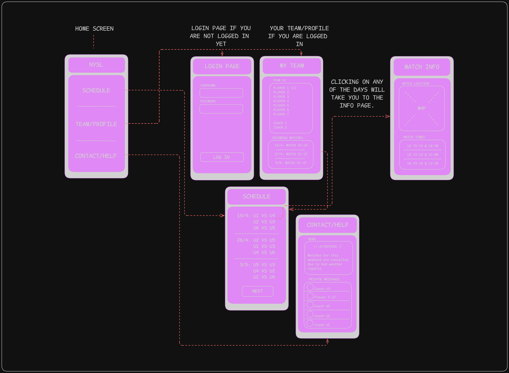

# NYSL CONCEPT

## 1. Personas and Scenarios:

### Persona 1: Karen Mitchell — Organized Team Parent

Age: 42

Occupation: Office administrator

Tech comfort: Moderate

Context: Karen’s son plays in the U7 team. She keeps track of schedules and often coordinates with other parents when plans change.

### Scenario — Checking Match Info and Notifying Others

Karen opens the NYSL app on Friday night.
She goes to Schedule → taps on U7 vs U3 (April 27) → opens the Match Info page.
She checks the location map and sees the game’s been moved to a new field.
Karen then navigates to Contact/Help, opens the Private Messages section, and sends a quick message to “Coach U7” confirming the new field directions.

Goal: Make sure she has the correct match info and let other parents know.
Outcome: Everyone arrives on time at the new field.

### Persona 2: Daniel “Danny” Brooks — U6 Player

Age: 14

Occupation: Student

Tech comfort: High

Context: Danny loves checking his stats and upcoming games. He uses the app mostly on mobile.

### Scenario — Checking Schedule and Team Lineup

On Saturday morning, Danny logs in using the Login Page.
After signing in, he lands on My Team, where he sees his name listed under Team U6 and the next game: “3/5: Match vs U3.”
He taps Schedule to double-check when other teams play so he can go watch his friends’ matches.

Goal: Stay updated on his own matches and know when his friends are playing.
Outcome: Danny arrives prepared and even cheers on another U7 game before his.

### Persona 3: Coach Lauren Rivera — U4 Team Coach

Age: 33

Occupation: Elementary school PE teacher

Tech comfort: High

Context: Lauren manages a young team and communicates often with parents about match times and cancellations.

### Scenario — Sending Alerts About Weather Cancellations

On Sunday morning, Lauren checks Contact/Help and sees the message board notice:
“Matches for this weekend are cancelled due to bad weather.”
She switches to Private Messages and selects her group (Coach U4 + Players’ Parents) to send a quick reminder confirming practice is also cancelled.

Goal: Keep her team informed about weather-related schedule changes.
Outcome: Parents and players don’t show up to a rained-out field, saving time and frustration.

## 2 Flowchart:

```
                      ┌───────────────────┐
                      │      LOGIN        │
                      │ (if not logged in)│
                      └───────┬───────────┘
                              │
                              ▼
                      ┌───────────────────┐
                      │      HOME         │
                      │   (Main Menu)     │
                      ├───────────────────┤
                      │  SCHEDULE         │
                      │  TEAM/PROFILE     │
                      │  CONTACT/HELP     │
                      └───────────────────┘
                         │       │       │
          ┌──────────────┘       │       └──────────────┐
          ▼                      ▼                      ▼
 ┌───────────────────┐   ┌───────────────────┐   ┌───────────────────┐
 │     SCHEDULE      │   │   TEAM / PROFILE  │   │   CONTACT / HELP  │
 │                   │   │ (If logged in)    │   │                   │
 │ View match list   │   │ Team roster, stats│   │ News, cancellations│
 │ Upcoming matches  │   │ Upcoming matches  │   │ + Private messages │
 └────────┬──────────┘   └─────────┬────────┘   └─────────┬──────────┘
          │                        │                      │
          ▼                        ▼                      ▼
 ┌───────────────────┐   ┌───────────────────┐   ┌───────────────────┐
 │    MATCH INFO     │   │   TEAM PROFILE    │   │     MESSAGING     │
 │                   │   │ Detailed info     │   │ Chat with coaches │
 │ Location (map)    │   │ about team & user │   │ or players        │
 │ Match times       │   │                   │   │                   │
 └────────┬──────────┘   └─────────┘          └─────────┘
          │
          ▼
 ┌───────────────────┐
 │     MESSAGING     │
 │ (Linked also from │
 │  Contact/Help)    │
 └───────────────────┘

```

## 3 Mock-up:



